# HackerRank Orchestrate

Starter repository for the **HackerRank Orchestrate** 24-hour hackathon (May 1–2, 2026).

Build a terminal-based AI agent that triages real support tickets across three product ecosystems; **HackerRank**, **Claude**, and **Visa** — using only the support corpus shipped in this repo.

Read [`problem_statement.md`](./problem_statement.md) for the full task spec, input/output schema, and allowed values, and [`evaluation_criteria.md`](./evaluation_criteria.md) for how submissions are scored.

---

## Setup (evaluators — primary instructions)

**Environment:** Python **3.11+**. Work from the **repository root** (the folder that contains this `README.md`).

| Step | Action |
|------|--------|
| **1. Dependencies** | `pip install -r code/requirements.txt` |
| **2. Secrets** | Copy `.env.example` → `.env` at the repo root. Set `OPENAI_API_KEY` if you use the LLM path, **or** set `ORCHESTRATE_DISABLE_LLM=1` for a fully offline run (no API calls). Never commit `.env`. |
| **3. Run the agent** | `python code/main.py` — reads `support_tickets/support_tickets.csv`, writes `support_tickets/output.csv`. Use `python code/main.py --help` for `--input`, `--output`, `--limit`. |
| **4. Regression check** | From `code/`: `ORCHESTRATE_DISABLE_LLM=1 python run_eval.py --offline` (optional). Full smoke: `pwsh -File scripts/verify_local.ps1` or `bash scripts/verify_local.sh` from repo root. |

**Cross-platform:** Prefer `python code/main.py` from the repo root on **Windows, Linux, and macOS**. Avoid `python -m code` on Unix-like systems (stdlib name clash). Details: [`code/README.md`](./code/README.md).

---

## Approach overview

This submission implements **offline retrieval-augmented triage** over the bundled markdown corpus in **`data/`** (no live web search for answer facts):

1. **Retrieval:** Hybrid **BM25 + TF-IDF** fusion with lexical reranking to fetch relevant support chunks (`code/retrieve.py`).
2. **Routing & safety:** Regex **risk** escalation and **cross-ecosystem** detection (mixed vendors in one ticket) before answer generation (`risk.py`, `cross_ecosystem.py`).
3. **Taxonomy:** Stable **`product_area`** labels aligned to corpus structure (`taxonomy.py`).
4. **Answer generation:** Optional **OpenAI** chat with **JSON over retrieved context only** (`openai_agent.py`); if the API is missing or `ORCHESTRATE_DISABLE_LLM=1`, **offline synthesis** builds replies from retrieved text (`answer_synthesis.py`).
5. **Grounding:** Post-generation lexical overlap and numeric guards (`grounding.py`, `postprocess.py`).

Deeper design decisions and trade-offs: [`docs/decisions.md`](./docs/decisions.md). Interview / limits: [`docs/interview.md`](./docs/interview.md), [`docs/scope_and_limits.md`](./docs/scope_and_limits.md).

---

## Packaging a ZIP (full project + this README)

The challenge may ask for your **complete working project** and a **README** with setup and approach — that is this **root `README.md`**, not only `code/README.md`.

**Recommended (clean, no secrets, no `.git` folder):** from the repo root, archive **tracked** files only:

```bash
git archive --format=zip -o ../hackerrank-orchestrate-submission.zip HEAD
```

Or run **`scripts/make_submission_zip.sh`** / **`scripts/make_submission_zip.ps1`** (same idea; writes next to the repo folder).

That typically includes `README.md`, `AGENTS.md`, `problem_statement.md`, `evaluation_criteria.md`, `code/`, `data/`, `support_tickets/`, `docs/`, `scripts/`, `.github/`, etc.—whatever is **committed**. Untracked junk (e.g. `.venv`, `code/.cache`) stays out if not committed.

**Do not** put API keys in the zip (never commit `.env`).

**If the platform requires a `code/`-only zip** instead, zip the `code/` directory — and **add a copy of the sections [Setup](#setup-evaluators--primary-instructions) and [Approach](#approach-overview) into `code/README.md`** so reviewers still see setup + approach in one place.

**Predictions** (`output.csv`) are often uploaded **separately** on HackerRank—follow the live submission page.

---

### Evaluation criteria (`evaluation_criteria.md`) — what this repo covers vs what you must bring

| Dimension | What the repo already supports | What you still own |
|-----------|----------------------------------|-------------------|
| **1. Agent Design** | Clear pipeline (`retrieve.py`, `openai_agent.py`, `postprocess.py`, `risk.py`, `taxonomy.py`), pinned `requirements.txt`, tests, CI, [`docs/decisions.md`](./docs/decisions.md) | Explaining trade-offs and alternatives in the **AI Judge interview** |
| **2. AI Judge Interview** | Prep in [`docs/interview.md`](./docs/interview.md), [`docs/demo-script.md`](./docs/demo-script.md) | Showing up, demonstrating depth, honesty about AI assistance |
| **3. Output CSV** | `main.py` → `support_tickets/output.csv`; run [`scripts/verify_local.ps1`](./scripts/verify_local.ps1) / [`scripts/verify_local.sh`](./scripts/verify_local.sh) before upload | Regenerating predictions on the final `support_tickets.csv`; hidden-set accuracy is scored by the platform |
| **4. AI Fluency (transcript)** | [`AGENTS.md`](./AGENTS.md) instructs tools to log turns to `%USERPROFILE%\hackerrank_orchestrate\log.txt` (Windows) / `$HOME/hackerrank_orchestrate/log.txt` (Unix) | **You** must collaborate visibly with intent—scoped prompts, critique, architectural steering—not blind acceptance |

**If many teams “meet” the bar — how is one winner chosen?** The public docs **do not publish exact weights or tie-break rules**. Typically: scores from **each dimension are combined** into a final score; **Output CSV** quality on **held-out rows** usually moves the leaderboard the most; **Interview** and **transcript** differentiate teams when numeric scores are close. Perfect ties across *all* dimensions are unlikely—small CSV differences still rank-order. For anything not specified here, treat **official platform / organizer communications** as source of truth.

**Baseline snapshot (Phase 0):** after meaningful routing/retrieval changes, run `python scripts/capture_baseline.py` from the repo root to refresh [`docs/superpowers/BASELINE.md`](./docs/superpowers/BASELINE.md) (git SHA, pytest count, sample routing %). **Per-row routing diff:** from `code/` after `ORCHESTRATE_DISABLE_LLM=1 python run_eval.py --offline`, run `python eval_sample.py --pred ../support_tickets/sample_pred.csv --routing-detail`.

**Verify before submit (matches CI + full offline batch):** from repo root, run `bash scripts/verify_local.sh` or `pwsh -File scripts/verify_local.ps1`. This installs `code/requirements.txt`, runs `main.py --help`, `pytest`, `run_eval.py --offline`, then `main.py --limit 0` with the LLM off. Set `VERIFY_SKIP_FULL_BATCH=1` to stop after the sample regression (faster). On macOS/Linux, `chmod +x scripts/*.sh` if needed. This does **not** prove hidden-test accuracy—only that the pipeline is healthy.

**Problem statement alignment (what this repo implements):**

| Requirement (`problem_statement.md`) | How it is addressed |
|--------------------------------------|---------------------|
| Terminal-based agent | `code/main.py` CLI; run via `python code/main.py` or `scripts/run_agent.*` |
| HackerRank / Claude / Visa | Corpus under `data/` per brand; retrieval uses brand mask + `infer_brand` when `Company` is `None` |
| Only provided corpus for answers | Retrieval from `data/` only; LLM (if enabled) is given **retrieved** chunks as context, not live web search |
| Request type, product area, reply vs escalate, justification | Output columns + `taxonomy.py`, `postprocess.py`, `risk.py`, `cross_ecosystem.py` |
| Retrieve relevant docs | Hybrid BM25 + TF-IDF fusion + rerank (`retrieve.py`) |
| Safe / grounded responses | Grounding overlap + numeric guard (`grounding.py`, `postprocess.py`); offline synthesis when LLM off |
| Escalate high-risk / sensitive | Regex risk routes before generation; low-retrieval flag; cross-ecosystem escalation |
| Handle noise / multi-topic / malicious-ish text | Invalid small-talk heuristics; risk patterns; multi-topic note (`ticket_hints.py`) |
| CSV input → CSV output | `csv_io.py`; writes `response`, `product_area`, `status`, `request_type`, `justification` |

**Cross-platform:** CI runs on **Ubuntu** (`python main.py` from `code/`). Use **`python code/main.py`** from the repo root on all OSes—avoid **`python -m code`** on Linux/macOS (stdlib `code` module name clash). **Windows:** use PowerShell scripts or `python code\main.py`. Same Python **3.11+** and `pip install -r code/requirements.txt` everywhere; keep `data/` next to `code/` as in the repo layout.

**Offline routing check:** with `ORCHESTRATE_DISABLE_LLM=1`, `cd code && python run_eval.py --offline` should show **100%** exact match on `status`, `request_type`, and `product_area` for the bundled sample (response text differs when the LLM is off).

### Start here (run the bundled agent)

From the **repository root** (after `pip install -r code/requirements.txt`):

| Shell | Command |
|-------|---------|
| **Any (recommended)** | `python code/main.py` — avoids shadowing the stdlib `code` module |
| **Any** | `cd code` then `python main.py` |
| **bash / zsh** | `./scripts/run_agent.sh` or `bash scripts/run_agent.sh` |
| **PowerShell** | `pwsh -File scripts/run_agent.ps1` |

**Note:** `python -m code` can invoke the **standard library** `code` module on Linux instead of this repo’s package—prefer `python code/main.py` or the scripts above.

Optional offline-only: set `ORCHESTRATE_DISABLE_LLM=1`, then run one of the above. Full CLI flags are in [`code/README.md`](./code/README.md).

**Interview / demo:** [`docs/interview.md`](./docs/interview.md), [`docs/demo-script.md`](./docs/demo-script.md). **Manual answer quality:** [`docs/DEV_EVAL.md`](./docs/DEV_EVAL.md). **Scope:** [`docs/scope_and_limits.md`](./docs/scope_and_limits.md).

---

## Contents

1. [Setup](#setup-evaluators--primary-instructions) · [Approach](#approach-overview) · [Packaging a ZIP](#packaging-a-zip-full-project--this-readme)
2. [Repository layout](#repository-layout)
3. [What you need to build](#what-you-need-to-build)
4. [Where your code goes](#where-your-code-goes)
5. [Quickstart](#quickstart)
6. [Chat transcript logging](#chat-transcript-logging)
7. [Submission](#submission)
8. [Judge interview](#judge-interview)
9. [Evaluation criteria](#evaluation-criteria)

---

## Repository layout

```
.
├── AGENTS.md                       # Rules for AI coding tools + transcript logging
├── problem_statement.md            # Full task description and I/O schema
├── README.md                       # You are here
├── docs/                           # decisions.md, interview prep, demo script, dev rubric
├── scripts/                        # run_agent.*, verify_local.*, make_submission_zip.*
├── code/                           # Participant agent (see code/README.md)
│   ├── main.py                     # CLI entry: reads CSV, writes predictions
│   ├── retrieve.py                 # Hybrid retrieval + reranking
│   ├── eval_sample.py              # Metrics vs sample_support_tickets.csv
│   └── tests/                      # pytest regression checks
├── data/                           # Offline support corpus (required to run locally)
│   ├── hackerrank/
│   ├── claude/
│   └── visa/
└── support_tickets/
    ├── sample_support_tickets.csv  # Labeled examples for development
    ├── support_tickets.csv         # Inputs for final predictions
    └── output.csv                  # Generated predictions (create by running the agent)
```

---

## What you need to build

A terminal-based agent that, for each row in `support_tickets/support_tickets.csv`, produces:

| Column         | Allowed values                                          |
| -------------- | ------------------------------------------------------- |
| `status`       | `replied`, `escalated`                                  |
| `product_area` | most relevant support category / domain area            |
| `response`     | user-facing answer grounded in the provided corpus      |
| `justification`| concise explanation of the routing/answering decision   |
| `request_type` | `product_issue`, `feature_request`, `bug`, `invalid`    |

Hard requirements (from `problem_statement.md`):

- Must be **terminal-based**.
- Must use **only the provided support corpus** (no live web calls for ground-truth answers).
- Must **escalate** high-risk, sensitive, or unsupported cases instead of guessing.
- Must avoid hallucinated policies or unsupported claims.

Beyond that you are free to bring your own approach — RAG, vector DBs, tool use, structured output, agent frameworks, classical ML, or anything else.

---

## Where your code goes

Implement the agent under [`code/`](./code/). This checkout includes a **Python** reference implementation: hybrid retrieval over `data/`, risk-based escalation, optional OpenAI JSON generation with offline fallback, and CSV I/O. Full setup, environment variables, and regression commands are documented in **[`code/README.md`](./code/README.md)**.

Conventions:

- Read secrets **only from environment variables** (see `.env.example`). **Never hardcode keys.**
- Be **deterministic** where possible (seeded retrieval / sampling).
- Write predictions to `support_tickets/output.csv`.

---

## Quickstart

Clone the repository and keep the **`data/`** folder next to `code/` — the agent does not fetch live help-center content; it reads the bundled corpus.

```bash
cd hackerrank-orchestrate-may26
python -m venv .venv
.venv\Scripts\activate          # Windows
# source .venv/bin/activate     # macOS / Linux
pip install -r code/requirements.txt
# Optional: fully offline run (no LLM API)
set ORCHESTRATE_DISABLE_LLM=1   # Windows cmd
# export ORCHESTRATE_DISABLE_LLM=1   # macOS / Linux
python code/main.py
```

This writes `support_tickets/output.csv`. **Regression:** `cd code` then `python run_eval.py --offline` (compares to `sample_support_tickets.csv`).

For **ZIP packaging**, see [Packaging a ZIP](#packaging-a-zip-full-project--this-readme). Historically some docs mentioned zipping only `code/`; **follow the current submission UI**—often the **full starter-repo layout** (including `data/` and this README) is what “complete project” means.

---

## Chat transcript logging

This repo ships with an `AGENTS.md` that any modern AI coding tool (Cursor, Claude Code, Codex, Gemini CLI, Copilot, etc.) will read. It instructs the tool to append every conversation turn to a single shared log file:

| Platform       | Path                                              |
| -------------- | ------------------------------------------------- |
| macOS / Linux  | `$HOME/hackerrank_orchestrate/log.txt`            |
| Windows        | `%USERPROFILE%\hackerrank_orchestrate\log.txt`    |

You don't need to do anything to enable it — just use your AI tool normally. You'll upload this `log.txt` as your chat transcript at submission time.

---

## Submission

Submit on the HackerRank Community Platform:
<https://www.hackerrank.com/contests/hackerrank-orchestrate-may26/challenges/support-agent/submission>

You will typically upload **three** artifacts:

1. **Code / project zip** — Often the **full repository** (this README + `code/` + `data/` + …); see [Packaging a ZIP](#packaging-a-zip-full-project--this-readme). Exclude secrets and local venvs (`git archive` helps).
2. **Predictions CSV** — agent output for `support_tickets/support_tickets.csv` (usually `output.csv`), **if** the platform asks for it separately.
3. **Chat transcript** — `log.txt` from [Chat transcript logging](#chat-transcript-logging), **if** required.

Always confirm fields on the **live submission page**—wording can change between rounds.

---

## Judge interview

After a successful submission, your AI Judge interview will happen within a few hours after the hackathon ends. It will stay open for the next 4 hours. 

The AI Judge will have access to your submission and may ask about your approach, decisions, and how you used AI while building your solution. The interview will be 30 minutes long, and keeping your camera on is mandatory.

Results will be announced on May 15, 2026

---

## Evaluation criteria

Submissions are scored across four dimensions: agent design (your `code/`), the AI Judge interview, output accuracy on `support_tickets/output.csv`, and AI fluency from your chat transcript.

See [`evaluation_criteria.md`](./evaluation_criteria.md) for the full rubric. Design notes for this repo’s agent: [`docs/decisions.md`](./docs/decisions.md).


<!-- AUTONOMOUS_SECTION_START -->

---

# 🤖 Autonomous Repository System


*This section is automatically maintained by the AI documentation agent.*

## System Overview
AI generated architecture summary not available.

## Key Features & Technology Stack
- **Frameworks Detected:** pytest, openai
- Automatically traces internal dependencies across 38 python files.
- Generates interactive Mermaid architectures and documentation.

# Architecture Diagrams

## Dependency Graph

```mermaid
graph TD
    node_0["conftest.py"]
    click node_0 href "../code/conftest.py"
    node_1["csv_io.py"]
    click node_1 href "../code/csv_io.py"
    node_2["compare_outputs.py"]
    click node_2 href "../code/compare_outputs.py"
    node_3["risk.py"]
    click node_3 href "../code/risk.py"
    node_4["openai_agent.py"]
    click node_4 href "../code/openai_agent.py"
    node_5["main.py"]
    click node_5 href "../code/main.py"
    node_6["eval_sample.py"]
    click node_6 href "../code/eval_sample.py"
    node_7["grounding.py"]
    click node_7 href "../code/grounding.py"
    node_8["eval_metrics.py"]
    click node_8 href "../code/eval_metrics.py"
    node_9["__main__.py"]
    click node_9 href "../code/__main__.py"
    node_10["run_eval.py"]
    click node_10 href "../code/run_eval.py"
    node_11["response_quality_report.py"]
    click node_11 href "../code/response_quality_report.py"
    node_12["__init__.py"]
    click node_12 href "../code/__init__.py"
    node_13["ticket_hints.py"]
    click node_13 href "../code/ticket_hints.py"
    node_14["cross_ecosystem.py"]
    click node_14 href "../code/cross_ecosystem.py"
    node_15["postprocess.py"]
    click node_15 href "../code/postprocess.py"
    node_16["corpus.py"]
    click node_16 href "../code/corpus.py"
    node_17["config.py"]
    click node_17 href "../code/config.py"
    node_18["answer_synthesis.py"]
    click node_18 href "../code/answer_synthesis.py"
    node_19["retrieve.py"]
    click node_19 href "../code/retrieve.py"
    node_20["taxonomy.py"]
    click node_20 href "../code/taxonomy.py"
    node_21["test_sample_routing_golden.py"]
    click node_21 href "../code/tests/test_sample_routing_golden.py"
    node_22["test_ticket_hints.py"]
    click node_22 href "../code/tests/test_ticket_hints.py"
    node_23["test_eval_metrics.py"]
    click node_23 href "../code/tests/test_eval_metrics.py"
    node_24["test_csv_io.py"]
    click node_24 href "../code/tests/test_csv_io.py"
    node_25["test_cli_main.py"]
    click node_25 href "../code/tests/test_cli_main.py"
    node_26["test_module_invocation.py"]
    click node_26 href "../code/tests/test_module_invocation.py"
    node_27["test_merge_cli.py"]
    click node_27 href "../code/tests/test_merge_cli.py"
    node_28["test_taxonomy.py"]
    click node_28 href "../code/tests/test_taxonomy.py"
    node_29["test_risk.py"]
    click node_29 href "../code/tests/test_risk.py"
    node_30["test_cross_ecosystem.py"]
    click node_30 href "../code/tests/test_cross_ecosystem.py"
    node_31["capture_baseline.py"]
    click node_31 href "../scripts/capture_baseline.py"
    node_32["ai_qa_agent.py"]
    click node_32 href "../automation/ai_qa_agent.py"
    node_33["diagrams.py"]
    click node_33 href "../automation/diagrams.py"
    node_34["readme_generator.py"]
    click node_34 href "../automation/readme_generator.py"
    node_35["analyzer.py"]
    click node_35 href "../automation/analyzer.py"
    node_36["__init__.py"]
    click node_36 href "../automation/__init__.py"
    node_37["ai_agent.py"]
    click node_37 href "../automation/ai_agent.py"
    node_0 --> node_17
    node_0 --> node_17
    node_0 --> node_19
    node_2 --> node_1
    node_2 --> node_1
    node_2 --> node_1
    node_2 --> node_1
    node_2 --> node_8
    node_2 --> node_8
    node_2 --> node_8
    node_4 --> node_18
    node_4 --> node_17
    node_4 --> node_19
    node_4 --> node_19
    node_5 --> node_17
    node_5 --> node_17
    node_5 --> node_17
    node_5 --> node_17
    node_5 --> node_17
    node_5 --> node_17
    node_5 --> node_14
    node_5 --> node_1
    node_5 --> node_1
    node_5 --> node_1
    node_5 --> node_4
    node_5 --> node_37
    node_5 --> node_4
    node_5 --> node_37
    node_5 --> node_15
    node_5 --> node_19
    node_5 --> node_19
    node_5 --> node_19
    node_5 --> node_19
    node_5 --> node_3
    node_5 --> node_20
    node_5 --> node_13
    node_6 --> node_1
    node_6 --> node_1
    node_6 --> node_1
    node_6 --> node_1
    node_6 --> node_8
    node_6 --> node_8
    node_6 --> node_8
    node_7 --> node_16
    node_7 --> node_19
    node_9 --> node_5
    node_11 --> node_17
    node_11 --> node_17
    node_11 --> node_17
    node_11 --> node_1
    node_11 --> node_1
    node_11 --> node_16
    node_11 --> node_7
    node_11 --> node_7
    node_11 --> node_19
    node_11 --> node_19
    node_15 --> node_17
    node_15 --> node_17
    node_15 --> node_7
    node_15 --> node_7
    node_15 --> node_19
    node_15 --> node_20
    node_15 --> node_20
    node_15 --> node_4
    node_15 --> node_37
    node_18 --> node_19
    node_19 --> node_17
    node_19 --> node_17
    node_19 --> node_17
    node_19 --> node_17
    node_19 --> node_17
    node_19 --> node_17
    node_19 --> node_17
    node_19 --> node_17
    node_19 --> node_17
    node_19 --> node_17
    node_19 --> node_17
    node_19 --> node_16
    node_19 --> node_16
    node_19 --> node_16
    node_20 --> node_16
    node_21 --> node_17
    node_21 --> node_1
    node_21 --> node_1
    node_21 --> node_5
    node_22 --> node_13
    node_22 --> node_13
    node_23 --> node_8
    node_23 --> node_8
    node_23 --> node_8
    node_24 --> node_1
    node_24 --> node_1
    node_24 --> node_1
    node_24 --> node_1
    node_28 --> node_20
    node_28 --> node_20
    node_28 --> node_20
    node_28 --> node_16
    node_29 --> node_3
    node_30 --> node_14
```




## API Documentation

### `code/answer_synthesis.py`

- **Function `extract_steps`**: Pull readable steps from support article bodies.

- **Function `synthesize_reply_from_hits`**: Return (user_response, source_paths_used).

### `code/cross_ecosystem.py`

- **Function `cross_ecosystem_escalation_reason`**: Return human-readable escalate reason, or None.

### `code/csv_io.py`

- **Class `TicketCsvError`**: User-fixable CSV / path issues (exit code 2).

- **Function `canonicalize_ticket_columns`**: Ensure Issue / Subject / Company column names (case-insensitive).

- **Function `read_tickets_csv`**: Read UTF-8 / UTF-8-BOM; raise clear errors for missing path or encoding.

- **Function `rename_prediction_columns`**: Case-insensitive rename of agent output columns to Pred_* names for gold merges.

### `code/eval_metrics.py`

- **Function `compact_overlap_ratio`**: Dice-like overlap on character bags (cheap fuzzy signal vs exact match).

- **Function `token_set_f1`**: Token-overlap F1 (bag of words; labels normalized).

### `code/grounding.py`

- **Function `has_unsupported_numbers`**: Flag digit-heavy claims not present in evidence (rough guardrail).

- **Function `lexical_overlap`**: Return fraction of non-trivial response tokens present in retrieved chunk text.

### `code/main.py`

- **Function `_truncate_row_fields`**: Copy row with Issue/Subject truncated if over max_chars (stderr warning).

### `code/retrieve.py`

- **Function `_tfidf_vectors`**: Tiny TF-IDF implementation (no sklearn), cosine-normalized per doc.

- **Function `rerank_hits`**: Lexical overlap rerank on top of BM25 scores.

- **Function `save`**: Atomically replace index file to avoid torn reads from concurrent runners.

### `code/taxonomy.py`

- **Function `looks_like_off_topic_general_knowledge`**: Entertainment / trivia / general-knowledge questions unlikely to be product support.

- **Function `map_product_area`**: Map evidence to one of CANONICAL_PRODUCT_AREAS when possible.

### `code/tests/test_cross_ecosystem.py`

- **Function `test_no_false_positive_visa_sponsorship_only_hackerrank`**: Immigration 'visa' language without Visa-network product signals.

### `code/tests/test_sample_routing_golden.py`

- **Function `test_sample_support_routing_matches_golden`**: Every sample row: status, request_type, product_area must match labels when LLM is disabled.

### `code/ticket_hints.py`

- **Function `maybe_append_multi_topic_justification`**: Append a transparency note to justification only (does not change response body).

- **Function `ticket_may_span_multiple_topics`**: Heuristic: message might bundle several distinct asks (no NLP; best-effort).


## Automation Onboarding & Contribution
AI generation skipped.

<!-- AUTONOMOUS_SECTION_END -->


