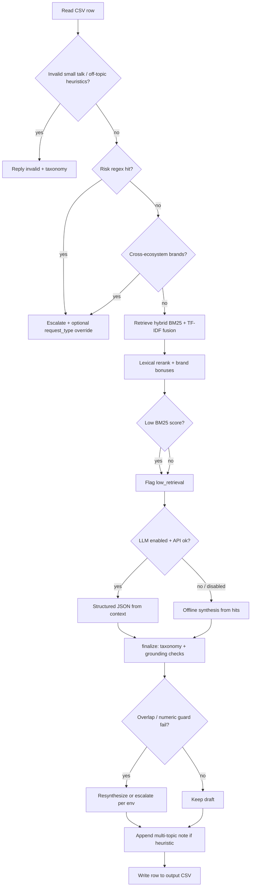

# Design decisions (Orchestrate agent)

This document is for reviewers and judge interviews: **why** the pipeline works the way it does, not only **what** each module does.

## Decision flow

## Five principles (why these choices)

1. **Offline corpus only for answers** — All user-facing claims must come from retrieved chunks (`data/`), with optional LLM **compression** over provided context. Parametric knowledge is not trusted for policies or steps.

2. **Hybrid retrieval** — BM25 finds lexically relevant candidates fast; fused TF‑IDF cosine helps when wording differs from the ticket. This is a **principled** hybrid, not “embedding because trendy.”

3. **Explicit escalation before creativity** — Regex risk routes (`risk.py`) fire **before** answer generation for known sensitive patterns (grading disputes, legal language, etc.). Better to escalate early than to invent policy.

4. **Cheap grounding gates** — Lexical overlap and numeric-string checks are **imperfect** but deterministic and fast; when they fail, we **regenerate from hits** (default) or **escalate** (`ORCHESTRATE_GROUNDING_FAIL_MODE=escalate`). Full entailment models were out of scope for the hackathon window.

5. **Canonical `product_area` labels** — Mapping uses corpus paths + brand-specific intent (e.g. Visa travel vs card loss). Labels match the challenge schema so outputs are **evaluable**, not free-form tags.

## Ablation note (public sample, offline)

We measured routing exact match on the **10-row** `sample_support_tickets.csv` with `ORCHESTRATE_DISABLE_LLM=1`:

| Variant | status | request_type | product_area |
|--------|--------|--------------|----------------|
| Default (hybrid fusion + rerank bonuses) | 100% | 100% | 100% |
| BM25-only fusion (`TFIDF_WEIGHT=0`, `BM25_WEIGHT=1`) | 100% | 100% | 100% |
| Rerank bonuses set to `0` | 100% | 100% | 100% |

The public sample is **too small** to separate these variants on routing accuracy. Hybrid fusion and rerank tuning are justified as **ranking stability** on noisier real tickets and longer queries, not as gains visible on this sample alone. **Hidden-set response quality** remains the main risk; use `compare_outputs.py` and manual spot checks for free-text columns.

## Scope boundaries

- **Cross-ecosystem tickets**: Pairwise detection (`cross_ecosystem.py`) **escalates** when HackerRank + Claude, HackerRank + Visa (financial product cues), or Claude + Visa appear together — avoids one dangerously blended answer.
- **Multi-topic (same brand)**: Heuristic detection (`ticket_hints.py`) appends a short note to **justification only** when the ticket likely bundles multiple asks; the model still produces a **single** primary reply (no automatic splitting).

## Related files

- Entry point: `code/main.py` or **`python code/main.py`** from repo root (avoid `python -m code`: stdlib shadowing on Linux)
- Cross-ecosystem routing: `code/cross_ecosystem.py`
- Retrieval: `code/retrieve.py`
- Grounding: `code/grounding.py`, `code/postprocess.py`
- Official rubric: [`../evaluation_criteria.md`](../evaluation_criteria.md)
- Interview Q&A: [`interview.md`](./interview.md) · Demo script: [`demo-script.md`](./demo-script.md) · Manual answer rubric: [`DEV_EVAL.md`](./DEV_EVAL.md) · Scope / non-goals: [`scope_and_limits.md`](./scope_and_limits.md)
