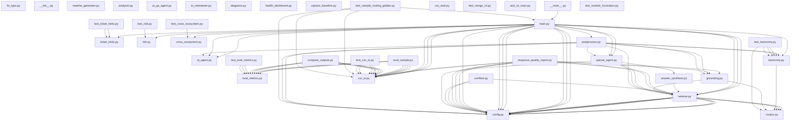

# Architecture Diagrams

## Dependency Graph

```mermaid
graph TD
    node_0["fix_type.py"]
    click node_0 href "./fix_type.py"
    node_1["__init__.py"]
    click node_1 href "./automation/__init__.py"
    node_2["readme_generator.py"]
    click node_2 href "./automation/readme_generator.py"
    node_3["analyzer.py"]
    click node_3 href "./automation/analyzer.py"
    node_4["ai_qa_agent.py"]
    click node_4 href "./automation/ai_qa_agent.py"
    node_5["ai_agent.py"]
    click node_5 href "./automation/ai_agent.py"
    node_6["ai_maintainer.py"]
    click node_6 href "./automation/ai_maintainer.py"
    node_7["diagrams.py"]
    click node_7 href "./automation/diagrams.py"
    node_8["health_dashboard.py"]
    click node_8 href "./automation/health_dashboard.py"
    node_9["capture_baseline.py"]
    click node_9 href "./scripts/capture_baseline.py"
    node_10["retrieve.py"]
    click node_10 href "./code/retrieve.py"
    node_11["eval_metrics.py"]
    click node_11 href "./code/eval_metrics.py"
    node_12["taxonomy.py"]
    click node_12 href "./code/taxonomy.py"
    node_13["main.py"]
    click node_13 href "./code/main.py"
    node_14["answer_synthesis.py"]
    click node_14 href "./code/answer_synthesis.py"
    node_15["__main__.py"]
    click node_15 href "./code/__main__.py"
    node_16["ticket_hints.py"]
    click node_16 href "./code/ticket_hints.py"
    node_17["response_quality_report.py"]
    click node_17 href "./code/response_quality_report.py"
    node_18["corpus.py"]
    click node_18 href "./code/corpus.py"
    node_19["conftest.py"]
    click node_19 href "./code/conftest.py"
    node_20["eval_sample.py"]
    click node_20 href "./code/eval_sample.py"
    node_21["risk.py"]
    click node_21 href "./code/risk.py"
    node_22["grounding.py"]
    click node_22 href "./code/grounding.py"
    node_23["config.py"]
    click node_23 href "./code/config.py"
    node_24["cross_ecosystem.py"]
    click node_24 href "./code/cross_ecosystem.py"
    node_25["openai_agent.py"]
    click node_25 href "./code/openai_agent.py"
    node_26["compare_outputs.py"]
    click node_26 href "./code/compare_outputs.py"
    node_27["csv_io.py"]
    click node_27 href "./code/csv_io.py"
    node_28["run_eval.py"]
    click node_28 href "./code/run_eval.py"
    node_29["postprocess.py"]
    click node_29 href "./code/postprocess.py"
    node_30["test_merge_cli.py"]
    click node_30 href "./code/tests/test_merge_cli.py"
    node_31["test_cli_main.py"]
    click node_31 href "./code/tests/test_cli_main.py"
    node_32["test_ticket_hints.py"]
    click node_32 href "./code/tests/test_ticket_hints.py"
    node_33["test_taxonomy.py"]
    click node_33 href "./code/tests/test_taxonomy.py"
    node_34["test_risk.py"]
    click node_34 href "./code/tests/test_risk.py"
    node_35["test_eval_metrics.py"]
    click node_35 href "./code/tests/test_eval_metrics.py"
    node_36["test_csv_io.py"]
    click node_36 href "./code/tests/test_csv_io.py"
    node_37["test_sample_routing_golden.py"]
    click node_37 href "./code/tests/test_sample_routing_golden.py"
    node_38["test_module_invocation.py"]
    click node_38 href "./code/tests/test_module_invocation.py"
    node_39["test_cross_ecosystem.py"]
    click node_39 href "./code/tests/test_cross_ecosystem.py"
    node_10 --> node_23
    node_10 --> node_23
    node_10 --> node_23
    node_10 --> node_23
    node_10 --> node_23
    node_10 --> node_23
    node_10 --> node_23
    node_10 --> node_23
    node_10 --> node_23
    node_10 --> node_18
    node_10 --> node_18
    node_10 --> node_18
    node_12 --> node_18
    node_13 --> node_23
    node_13 --> node_23
    node_13 --> node_23
    node_13 --> node_23
    node_13 --> node_23
    node_13 --> node_23
    node_13 --> node_24
    node_13 --> node_27
    node_13 --> node_27
    node_13 --> node_27
    node_13 --> node_5
    node_13 --> node_25
    node_13 --> node_5
    node_13 --> node_25
    node_13 --> node_29
    node_13 --> node_10
    node_13 --> node_10
    node_13 --> node_10
    node_13 --> node_23
    node_13 --> node_21
    node_13 --> node_12
    node_13 --> node_16
    node_14 --> node_10
    node_15 --> node_13
    node_17 --> node_23
    node_17 --> node_23
    node_17 --> node_23
    node_17 --> node_27
    node_17 --> node_27
    node_17 --> node_22
    node_17 --> node_22
    node_17 --> node_10
    node_17 --> node_10
    node_19 --> node_23
    node_19 --> node_23
    node_19 --> node_10
    node_20 --> node_27
    node_20 --> node_27
    node_20 --> node_27
    node_20 --> node_27
    node_20 --> node_11
    node_20 --> node_11
    node_20 --> node_11
    node_22 --> node_18
    node_22 --> node_10
    node_25 --> node_14
    node_25 --> node_23
    node_25 --> node_10
    node_25 --> node_10
    node_26 --> node_27
    node_26 --> node_27
    node_26 --> node_27
    node_26 --> node_27
    node_26 --> node_11
    node_26 --> node_11
    node_26 --> node_11
    node_29 --> node_23
    node_29 --> node_23
    node_29 --> node_22
    node_29 --> node_22
    node_29 --> node_10
    node_29 --> node_12
    node_29 --> node_12
    node_29 --> node_5
    node_29 --> node_25
    node_32 --> node_16
    node_32 --> node_16
    node_33 --> node_12
    node_33 --> node_12
    node_33 --> node_12
    node_33 --> node_18
    node_34 --> node_21
    node_35 --> node_11
    node_35 --> node_11
    node_35 --> node_11
    node_36 --> node_27
    node_36 --> node_27
    node_36 --> node_27
    node_36 --> node_27
    node_37 --> node_23
    node_37 --> node_27
    node_37 --> node_27
    node_37 --> node_13
    node_39 --> node_24
```
