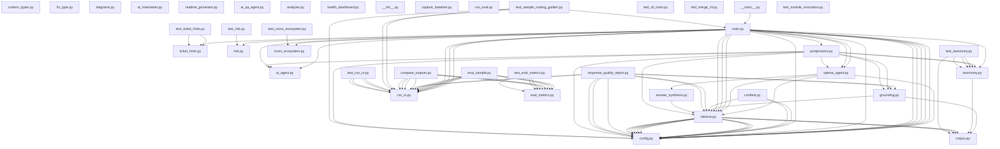

# Architecture Diagrams

## Dependency Graph

```mermaid
graph TD
    node_0["custom_types.py"]
    click node_0 href "../custom_types.py"
    node_1["fix_type.py"]
    click node_1 href "../fix_type.py"
    node_2["diagrams.py"]
    click node_2 href "../automation/diagrams.py"
    node_3["ai_maintainer.py"]
    click node_3 href "../automation/ai_maintainer.py"
    node_4["readme_generator.py"]
    click node_4 href "../automation/readme_generator.py"
    node_5["ai_qa_agent.py"]
    click node_5 href "../automation/ai_qa_agent.py"
    node_6["analyzer.py"]
    click node_6 href "../automation/analyzer.py"
    node_7["health_dashboard.py"]
    click node_7 href "../automation/health_dashboard.py"
    node_8["ai_agent.py"]
    click node_8 href "../automation/ai_agent.py"
    node_9["__init__.py"]
    click node_9 href "../automation/__init__.py"
    node_10["capture_baseline.py"]
    click node_10 href "../scripts/capture_baseline.py"
    node_11["openai_agent.py"]
    click node_11 href "../code/openai_agent.py"
    node_12["ticket_hints.py"]
    click node_12 href "../code/ticket_hints.py"
    node_13["main.py"]
    click node_13 href "../code/main.py"
    node_14["grounding.py"]
    click node_14 href "../code/grounding.py"
    node_15["run_eval.py"]
    click node_15 href "../code/run_eval.py"
    node_16["conftest.py"]
    click node_16 href "../code/conftest.py"
    node_17["csv_io.py"]
    click node_17 href "../code/csv_io.py"
    node_18["risk.py"]
    click node_18 href "../code/risk.py"
    node_19["corpus.py"]
    click node_19 href "../code/corpus.py"
    node_20["eval_sample.py"]
    click node_20 href "../code/eval_sample.py"
    node_21["taxonomy.py"]
    click node_21 href "../code/taxonomy.py"
    node_22["retrieve.py"]
    click node_22 href "../code/retrieve.py"
    node_23["eval_metrics.py"]
    click node_23 href "../code/eval_metrics.py"
    node_24["config.py"]
    click node_24 href "../code/config.py"
    node_25["response_quality_report.py"]
    click node_25 href "../code/response_quality_report.py"
    node_26["compare_outputs.py"]
    click node_26 href "../code/compare_outputs.py"
    node_27["__main__.py"]
    click node_27 href "../code/__main__.py"
    node_28["answer_synthesis.py"]
    click node_28 href "../code/answer_synthesis.py"
    node_29["postprocess.py"]
    click node_29 href "../code/postprocess.py"
    node_30["cross_ecosystem.py"]
    click node_30 href "../code/cross_ecosystem.py"
    node_31["test_cli_main.py"]
    click node_31 href "../code/tests/test_cli_main.py"
    node_32["test_merge_cli.py"]
    click node_32 href "../code/tests/test_merge_cli.py"
    node_33["test_cross_ecosystem.py"]
    click node_33 href "../code/tests/test_cross_ecosystem.py"
    node_34["test_ticket_hints.py"]
    click node_34 href "../code/tests/test_ticket_hints.py"
    node_35["test_sample_routing_golden.py"]
    click node_35 href "../code/tests/test_sample_routing_golden.py"
    node_36["test_taxonomy.py"]
    click node_36 href "../code/tests/test_taxonomy.py"
    node_37["test_module_invocation.py"]
    click node_37 href "../code/tests/test_module_invocation.py"
    node_38["test_eval_metrics.py"]
    click node_38 href "../code/tests/test_eval_metrics.py"
    node_39["test_csv_io.py"]
    click node_39 href "../code/tests/test_csv_io.py"
    node_40["test_risk.py"]
    click node_40 href "../code/tests/test_risk.py"
    node_11 --> node_28
    node_11 --> node_24
    node_11 --> node_22
    node_11 --> node_22
    node_13 --> node_24
    node_13 --> node_24
    node_13 --> node_24
    node_13 --> node_24
    node_13 --> node_24
    node_13 --> node_24
    node_13 --> node_30
    node_13 --> node_17
    node_13 --> node_17
    node_13 --> node_17
    node_13 --> node_8
    node_13 --> node_11
    node_13 --> node_8
    node_13 --> node_11
    node_13 --> node_29
    node_13 --> node_22
    node_13 --> node_22
    node_13 --> node_22
    node_13 --> node_24
    node_13 --> node_18
    node_13 --> node_21
    node_13 --> node_12
    node_14 --> node_19
    node_14 --> node_22
    node_16 --> node_24
    node_16 --> node_24
    node_16 --> node_22
    node_20 --> node_17
    node_20 --> node_17
    node_20 --> node_17
    node_20 --> node_17
    node_20 --> node_23
    node_20 --> node_23
    node_20 --> node_23
    node_21 --> node_19
    node_22 --> node_24
    node_22 --> node_24
    node_22 --> node_24
    node_22 --> node_24
    node_22 --> node_24
    node_22 --> node_24
    node_22 --> node_24
    node_22 --> node_24
    node_22 --> node_24
    node_22 --> node_19
    node_22 --> node_19
    node_22 --> node_19
    node_25 --> node_24
    node_25 --> node_24
    node_25 --> node_24
    node_25 --> node_17
    node_25 --> node_17
    node_25 --> node_14
    node_25 --> node_14
    node_25 --> node_22
    node_25 --> node_22
    node_26 --> node_17
    node_26 --> node_17
    node_26 --> node_17
    node_26 --> node_17
    node_26 --> node_23
    node_26 --> node_23
    node_26 --> node_23
    node_27 --> node_13
    node_28 --> node_22
    node_29 --> node_24
    node_29 --> node_24
    node_29 --> node_14
    node_29 --> node_14
    node_29 --> node_22
    node_29 --> node_21
    node_29 --> node_21
    node_29 --> node_8
    node_29 --> node_11
    node_33 --> node_30
    node_34 --> node_12
    node_34 --> node_12
    node_35 --> node_24
    node_35 --> node_17
    node_35 --> node_17
    node_35 --> node_13
    node_36 --> node_21
    node_36 --> node_21
    node_36 --> node_21
    node_36 --> node_19
    node_38 --> node_23
    node_38 --> node_23
    node_38 --> node_23
    node_39 --> node_17
    node_39 --> node_17
    node_39 --> node_17
    node_39 --> node_17
    node_40 --> node_18
```
